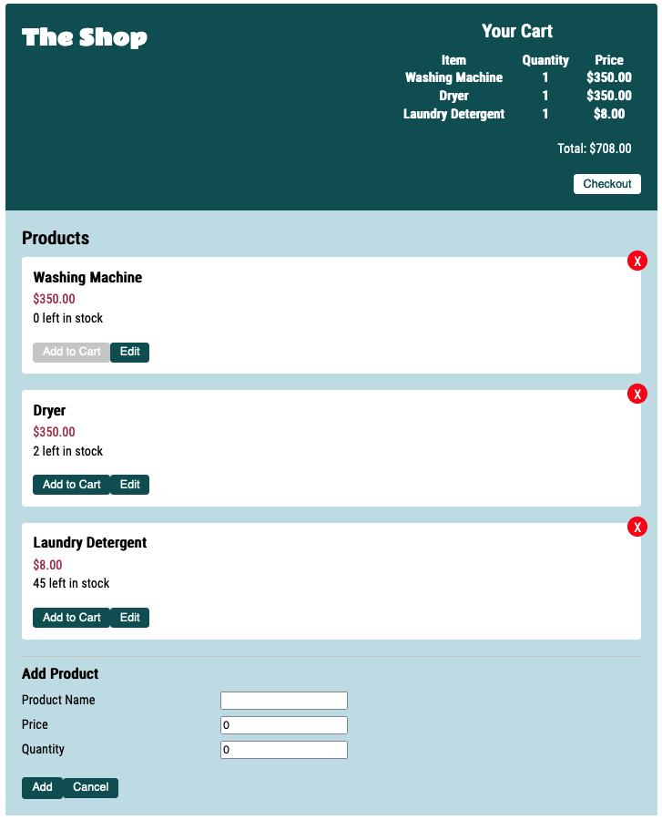
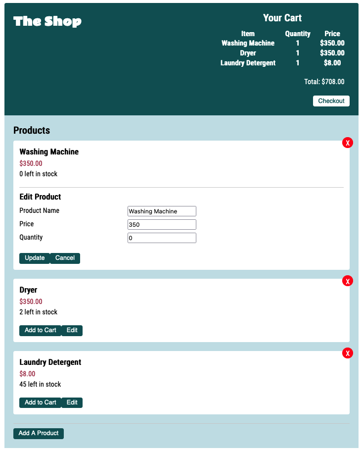
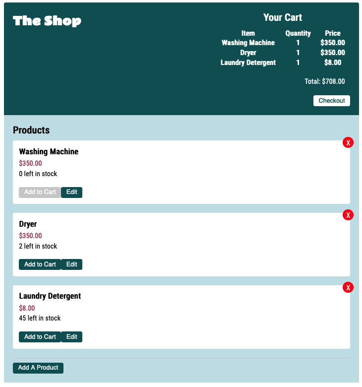

# Shopping Cart App

## Background

The purpose of building this application was to build proficiency with React and
Docker.

You'll find both a Dockerfile and a Docker Compose file that can be utilized to
build the containerized version of the application locally.

## DataBase Setup

1. Create mongoDB account - https://account.mongodb.com/account/register
2. Go to `collections` and create a new database (shopping_cart) with two
   collections `products` and `cartitems`.
3. Under Security tab, click Database Access, and on the right
   `add new database user`. After you enter username and password, click
   `add user` at the bottom right corner.
4. Under Security tab, click Network Access, and whitelist your IP address.
5. Once your cluster is created, under Clusters tab, click connect and copy the
   connection string which will look something like this
   `mongodb+srv://<username>:<password>@cluster0-zamyu.mongodb.net/<collection_name>?retryWrites=true&w=majority`.
   Replace the username, password, and collection_name with the appropriate
   names.
6. Save the 'docker-compose.yaml' file into a folder, which can be found in the
   main branch of this repository. Edit the 'docker-compose.yaml', replacing -
   `mongodb+srv://<username>:<password>@cluster0-zamyu.mongodb.net/<collection_name>?retryWrites=true&w=majority`
   with your mongoDB connection string.
7. Run the command `docker-compose -f docker-compose.yaml up` and the
   shopping-cart application will be available for you on Port 5001 of your
   machine.

## User Interface

Here's an example of what the user interface looks like.

### **Add Product Display**

 

### **Edit Product Display**

 

### **Cart Header Display**

 
